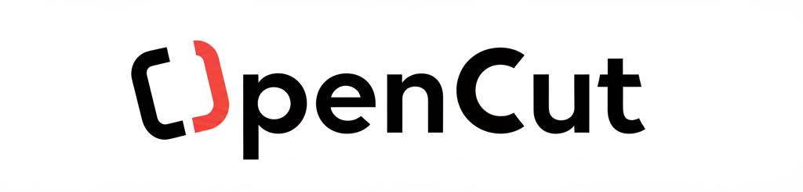

<table width="100%">
  <tr>
    <td align="left" width="120">
      
    </td>
    <td align="right">
      <h1>OpenCut <span style="font-size: 0.7em; font-weight: normal;">(prev AppCut)</span></h1>
      <h3 style="margin-top: -10px;">A free, open-source video editor for web, desktop, and mobile.</h3>
    </td>
  </tr>
</table>

## Why?

- **Privacy**: Your videos stay on your device
- **Free features**: Every basic feature of CapCut is paywalled now
- **Simple**: People want editors that are easy to use - CapCut proved that

## Features

### Core Features
- Timeline-based editing
- Multi-track support (Media, Text, Audio tracks)
- Real-time preview
- No watermarks or subscriptions
- Analytics provided by [Databuddy](https://www.databuddy.cc?utm_source=opencut), 100% Anonymized & Non-invasive.

### Advanced Features ✨
- **Audio Library & Management** - Comprehensive audio library with free sample tracks, search, filtering by categories (Nature, Electronic, Classical, Corporate, Acoustic, Hip Hop), and drag-and-drop functionality
- **Audio Extraction** - Extract audio from MP4 videos with one-click conversion to audio files
- **Professional Video Export** - Export videos with multiple quality presets (480p to 4K), custom bitrates, frame rates up to 120 FPS, with full audio mixing support
- **Waveform Visualization** - Real-time audio waveform display using WaveSurfer.js
- **Multi-format Support** - Support for video (MP4, WebM), audio (MP3, WAV, M4A), and image formats
- **Drag & Drop Interface** - Intuitive file management with drag-and-drop timeline editing

## Project Structure

- `apps/web/` – Main Next.js web application
- `src/components/` – UI and editor components
  - `src/components/editor/` – Timeline and video editing components
  - `src/components/editor/media-panel/` – Media library and audio management
  - `src/components/ui/` – Reusable UI components
- `src/hooks/` – Custom React hooks
- `src/lib/` – Utility and API logic
  - `src/lib/video-export.ts` – Professional video export service
  - `src/lib/storage/` – Client-side storage management
- `src/stores/` – State management (Zustand, etc.)
- `src/types/` – TypeScript types

## Getting Started

### Prerequisites

Before you begin, ensure you have the following installed on your system:

- [Bun](https://bun.sh/docs/installation)
- [Docker](https://docs.docker.com/get-docker/) and [Docker Compose](https://docs.docker.com/compose/install/)
- [Node.js](https://nodejs.org/en/) (for `npm` alternative)

### Setup

1.  **Clone the repository**

    ```bash
    git clone https://github.com/OpenCut-app/OpenCut.git
    cd OpenCut
    ```

2.  **Start backend services**
    From the project root, start the PostgreSQL and Redis services:

    ```bash
    docker-compose up -d
    ```

3.  **Set up environment variables**
    Navigate into the web app's directory and create a `.env` file from the example:

    ```bash
    cd apps/web


    # Unix/Linux/Mac
    cp .env.example .env.local

    # Windows Command Prompt
    copy .env.example .env.local

    # Windows PowerShell
    Copy-Item .env.example .env.local
    ```

    _The default values in the `.env` file should work for local development._

4.  **Install dependencies**
    Install the project dependencies using `bun` (recommended) or `npm`.

    ```bash
    # With bun
    bun install

    # Or with npm
    npm install
    ```

5.  **Run database migrations**
    Apply the database schema to your local database:

    ```bash
    # With bun
    bun run db:push:local

    # Or with npm
    npm run db:push:local
    ```

6.  **Start the development server**

    ```bash
    # With bun
    bun run dev

    # Or with npm
    npm run dev
    ```

The application will be available at [http://localhost:3000](http://localhost:3000).

## Contributing

**Note**: We're currently moving at an extremely fast pace with rapid development and breaking changes. While we appreciate the interest, it's recommended to wait until the project stabilizes before contributing to avoid conflicts and wasted effort.

## Visit [CONTRIBUTING.md](.github/CONTRIBUTING.md)

We welcome contributions! Please see our [Contributing Guide](.github/CONTRIBUTING.md) for detailed setup instructions and development guidelines.

**Quick start for contributors:**

- Fork the repo and clone locally
- Follow the setup instructions in CONTRIBUTING.md
- Create a feature branch and submit a PR

## Credits & Attribution

### Advanced Features Development
The following advanced features were developed and contributed by **[hoanggxyuuki](https://github.com/hoanggxyuuki)**:

- **Audio Library System** - Complete audio management with sample library, search, and categorization
- **Audio Extraction Technology** - MP4 to audio conversion with browser-native processing
- **Professional Video Export Engine** - Multi-format video export with audio mixing and quality presets
- **Waveform Visualization** - Real-time audio visualization and timeline integration
- **Enhanced Timeline Controls** - Multi-track editing with drag-and-drop functionality

*These contributions significantly enhanced OpenCut's capabilities, bringing it closer to professional video editing standards.*

## Sponsors

Thanks to [Vercel](https://vercel.com?utm_source=github-opencut&utm_campaign=oss) for their support of open-source software.

[](https://vercel.com/new/clone?repository-url=https%3A%2F%2Fgithub.com%2FOpenCut-app%2FOpenCut&project-name=opencut&repository-name=opencut)

## License

[MIT LICENSE](LICENSE)

---

[]
# OpenCut-Advance
